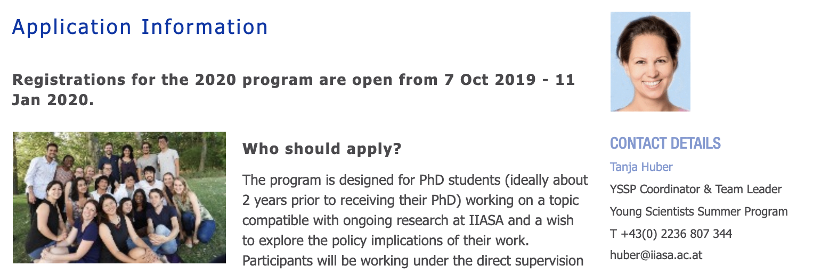
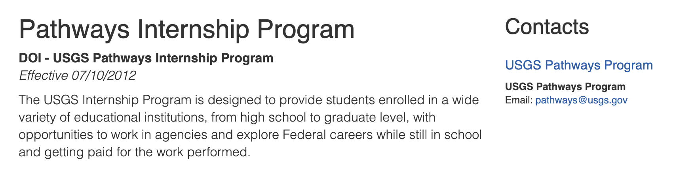

layout: true
background-image: url(images/USGS_logo.png)
background-size: 10%
background-position: left 110px bottom 10px 
---
```{r setup, include=FALSE}
knitr::opts_chunk$set(echo = TRUE)
```
class: inverse, left, middle

# Brief Overview of Past and Ongoing Research
???
- I am thrilled to be here, because as many of you know, I actually obtained my bachelors and my master’s degrees from this department!
- So, now the prodigal student has returned and she is super smart and has yet another tedious degree!
- So I'd like to give a brief overview of some of my past work, as I think it really sets the stage for how the stars have aligned with this postdoc, and how great of a fit this is for the USGS. 
---
# <!--My Past Work 0--> 
.center[</br></br>
```{r echo=FALSE, out.width='100%'}
knitr::include_graphics('/images/efforts/Slide01.png')
# pagedown::chrome_print("path/to/your/slides.Rmd")
```
]
???
- I'd like to first start with an overview of my research to-date, including some ongoing projects
- B/c I think it will tell a nice story of how I've come to be in the position I am in now
- And how my previous works have influenced my perspective and appreciation for translational ecology, today.
---
# <!--My Past Work 1--> 
.center[</br></br>
```{r echo=FALSE, out.width='100%'}
knitr::include_graphics('/images/efforts/Slide02.png')
```
]
???
- So, my research activities to date originate here in WEC, where exposure to birds by a one Katie Sieving really opened up the doors to research as a career option for me. 
---
# <!--My Past Work 2--> 
.center[</br></br>
```{r echo=FALSE, out.width='100%'}
knitr::include_graphics('/images/efforts/Slide03.png')
```
]
???
- My earliest works included field ornithology -- working with Dr. Sieving on various projects
- Eventually designing my own project wherein we used playbacks of screaming titmice to determine whether we could draw in hawks and owls. 
---
# <!--My Past Work 3--> 
.center[</br></br>
```{r echo=FALSE, out.width='100%'}
knitr::include_graphics('/images/efforts/Slide04.png')
```
]
.footnote[(_in prep_) intended for submission to  _Florida Field Naturalist_]
???
- An ongoing collaboration with Scott Robinson adn Andy Kratter at the museum includes using the data collected over past decades during the Gainesville, FL  Christmas Bird Count -- where we are using inference gained from these population trends to generalize guild trends in response to urbanization and habitat loss in North Central Florida.
---
# <!--My Past Work 4--> 
.center[</br></br>
```{r echo=FALSE, out.width='100%'}
knitr::include_graphics('/images/efforts/Slide05.png')
```
]
???
- Much of my work has also focused on non-native and invasive populations of fauna in North America. ---
# <!--My Past Work 5--> 
.center[</br></br>
```{r echo=FALSE, out.width='100%'}
knitr::include_graphics('/images/efforts/Slide06.png')
```
]
???
- For example, during my Masters here, I worked primarily with Mike MOulton to track and understand the factors influencing the distribution of arguably the best urban exploiter species, teh House Sparrow.
---
# <!--My Past Work 6--> 
.center[</br></br>
```{r echo=FALSE, out.width='100%'}
knitr::include_graphics('/images/efforts/Slide07.png')
```
]
???
- Further work on non-native bird population trends and distribution includes using participatory science data to track range shifts and expansion in Eurasian Tree sparrows... 
---

# <!--My Past Work 7--> 
.center[</br></br>
```{r echo=FALSE, out.width='100%'}
knitr::include_graphics('/images/efforts/Slide08.png')
```
]
.footnote[[1] Burnett, J, N Gilbert, N Anich (_in prep_) Great Tit introductions to and distribution in North America.]
???
- Hunting down records of Great Tits in north america to get basic documentation of introduction and distribution

---
# <!--My Past Work 8--> 
.center[</br></br>
```{r echo=FALSE, out.width='100%'}
knitr::include_graphics('/images/efforts/Slide09.png')
```
]
.footnote[[1] Burnett, J, N Gilbert, N Anich (_in prep_) Great Tit introductions to and distribution in North America. </br>Burnett, J, L Wszola, N Mirochnitchenko, E Stuber, M Bomberger Brown, J Carroll (_in prep_). [2] Gray Partridge distribution in North America: Changing landscapes for an introduced species. For submission to _Wildlife Biology_ ]
???
- And again using citizen science data to track the range shift and factors influencing the distrbution of the non-native Gray Partridge
---
# <!--My Past Work 9--> 
.center[</br></br>
```{r echo=FALSE, out.width='100%'}
knitr::include_graphics('/images/efforts/Slide10.png')
```
]

---
# <!--My Past Work 10--> 
.center[</br></br>
```{r echo=FALSE, out.width='100%'}
knitr::include_graphics('/images/efforts/Slide11.png')
```
]

---
# <!--My Past Work 11--> 
.center[</br></br>
```{r echo=FALSE, out.width='100%'}
knitr::include_graphics('/images/efforts/Slide12.png')
```
]
.footnote[[1] Burnett et al. (_under revision_) _American Malacological Bulletin_.]
---
# <!--My Past Work 12--> 
.center[</br></br>
```{r echo=FALSE, out.width='100%'}
knitr::include_graphics('/images/efforts/Slide13.png')
```
]
???
- Finally, other non-bird invasion work has included the spread and dsitribution of Eastern Redcedar into north american grasslands
- And the social-ecological factors associated with its distribution
---
# <!--My Past Work 13--> 
.center[</br></br>
```{r echo=FALSE, out.width='100%'}
knitr::include_graphics('/images/efforts/Slide14.png')
```
]
???
- Finally, my dissertation resaerch largely focused on statistical and nuemrical methods for identifying ecological regime shifts in community-level data. 
- Briefly, regime shifts are described as changes in the underlying structure or functioning of a system
- These shifts are particularly of interest when they affect human well-being, or economies
---
# <!--My Past Work 13--> 
.center[</br></br>
```{r echo=FALSE, out.width='100%'}
knitr::include_graphics('/images/efforts/Slide15.png')
```
]
???
- Finally, my dissertation resaerch largely focused on statistical and nuemrical methods for identifying ecological regime shifts in community-level data. 
- Briefly, regime shifts are described as changes in the underlying structure or functioning of a system
- These shifts are particularly of interest when they affect human well-being, or economies
---
# <!--My Past Work 14--> 
__<u>Theme 1</u>__: Synthesize and review regime shift methods and literature

--

__<u>Theme 2</u>__: Test the utility and efficacy of methods

--

__<u>Theme 3</u>__: Improve method accessibility


???
- For example, the death or bleaching of a coral reef system impacts not only the ecological system itself, but also impacts the human communities relying on its health
- For example, local ecotourism and fisheries may take a hit

---
# <!--My Past Work 15--> 
.center[</br></br>
```{r echo=FALSE, out.width='100%'}
knitr::include_graphics('/images/efforts/Slide16.png')
```
]
???
- Although numerous methods are proposed for identifying ecological regime shifts, these methods often produce false negatives, false positives, and rare do multiple methods produce similar results as to the location in time or space of an ecological regime shift. 
- In an attempt to get a bit closer to an understanding of when and where a method can be used, I applied numerous methods to empirical and simulated data. 
- Empirical multi-species time series, like this paleodiatom time series, are particvularly tricky when attempting to use some of the more established methods. 

---
# <!--My Past Work 15--> 
.center[</br></br>
```{r echo=FALSE, out.width='100%'}
knitr::include_graphics('/images/efforts/Slide17.png')
```
]
???
- For example, the coefficient of variation, or the ratio of mean to variance over some period of time within an individual species, produces spaghetti plots
- Or uninterpretable results, when examining the entire community. 
---
# <!--My Past Work 15--> 
.center[</br></br>
```{r echo=FALSE, out.width='100%'}
knitr::include_graphics('/images/efforts/Slide18.png')
```
]
.footnote[[1] Burnett, J, N Price, and A Tyre. (_in prep_). Distance travelled and velocity of distance travelled as a measure of abrupt change in multivariable ecological data.</br> [2] Burnett, J and N Price (2018). `regimeDetectionMeasures`: An R package for calculating univariate and multivariate regime detection measures.]
???
- Notably, in studying methods in detail, we identified a hidden method, rate of change of the distance travelled, sort of buried within the complicated steps of an alternative method. 
- We are calling this method, 'velocity', as it is a measure of the rate of change of an entire community, or multiple variables, over a period of time. 

---
# <!--My Past Work 15--> 
.center[</br></br>
```{r echo=FALSE, out.width='100%'}
knitr::include_graphics('/images/efforts/Slide19.png')
```
]
???
.footnote[[1] Burnett, J, E Rovenskaya, B Fath (_in prep_). Using resampling techniques to evaluate relative performance of regime detection measures.]
---
# <!--My Past Work 15--> 
.center[</br></br>
```{r echo=FALSE, out.width='100%'}
knitr::include_graphics('/images/efforts/Slide20.png')
```
]
???
- Been trying top operate within and promote the culture of open science
- Especially as it relates to making avalable data and result generation methods and code to the public
- E.g., using GitHub, or stable repositories
---
# <!--My Past Work 15--> 
.center[</br></br>
```{r echo=FALSE, out.width='100%'}
knitr::include_graphics('/images/efforts/Slide21.png')
```
]
.footnote[github.com/trashbirdecology/regimedetectionmeasures]

???
---
# <!--My Past Work 15--> 
.center[</br></br>
```{r echo=FALSE, out.width='100%'}
knitr::include_graphics('/images/efforts/Slide22.png')
```
]
.footnote[github.com/trashbirdecology/bbsAssistant]
???
---
# <!--My Past Work 15--> 
.center[</br></br>
```{r echo=FALSE, out.width='100%'}
knitr::include_graphics('/images/efforts/Slide23.png')
```
]
???
- And so all of the previously described efforts have led to my arpeciation for informaiton science 
- that is, 
  - how are we communicating our data and science products
  - how can we improve or methods of communication, sharing, reproducibility, etc.?
---

# <!--My Past Work 15--> 
.center[</br></br>
```{r echo=FALSE, out.width='100%'}
knitr::include_graphics('/images/efforts/Slide25.png')
```
]
???
- However, I argue that, if I am to continue down this previous path, sure I will produce decent science and some cool tools
- But these efforts may be futile ... __NEXT SLIDE__
---
# <!--My Past Work 15--> 
.center[</br></br>
```{r echo=FALSE, out.width='100%'}
knitr::include_graphics('/images/efforts/Slide26.png')
```
]
???
- Unless I make a serious effort to elicit and incorporate the needs of potential end-users, pracitioners, and decision makers
---
.center[
```{r echo=FALSE, out.width='100%'}
knitr::include_graphics('/images/my_research.png')
```
]
???
- So, to date, my research, which I have really enjoyed, can be generalized as comprising the following:
  - data management
    - so how do we store, retrieve, manipulate, and share data
  - and the modelling efforts associated with specific data, places, species, and phenomenon
---
class: inverse, left, middle
# Flow of Science Products and Knowledge
???
- But, as mentioned earlier, to make my science actionable requires understanding where my science is and is NOT going, and where I can make adjustments to improve its quality and dissemination. 
---
# Data and Science Products Often Flow Linearly
.center[
```{r echo=FALSE, out.width='100%'}
knitr::include_graphics('/images/use_continuum/Slide1.png')
```
]
???
- A stylized version of the flow of a science or data product flows  is as follows:
  - maybe it starts at he collector and curator, someone analyzes it or makes inference from it
  - Next, if you're lucky, either the data or science product goes to a practitioner
  - And even more rarely does that science trickle up to the deicsion makers. 
---
# Data and Science Products Often Flow Linearly
.center[
```{r echo=FALSE, out.width='100%'}
knitr::include_graphics('/images/use_continuum/Slide2.png')
```
]
???
- But for many of us, how often can we say that practitioners are influencing our science, or the way we communicate our science?
- How often do you hear from praxctitioners?
- How often do __you reach out__? to pracitioners?
---
# Data and Science Products Often Flow Linearly
.center[
```{r echo=FALSE, out.width='100%'}
knitr::include_graphics('/images/use_continuum/Slide3.png')
```
]
???
- Or how often do you seek feedback or try to identify the needs of end users?
- If never or rarely, there's reasonable explanations - 
  - perhaps you conduct basic research, or are a natural historian
  - or maybe this is an overwhelming task that may not necessarily be rewarded within your community or profession?
- There's a reason for these question marks -- __this is a daunting task!__
---

# <!--Roughgarden Quote-->
</br></br></br>
> 'Most models in ecology are inteded for other ecologists, cooked up by scientists for consumption by other scientists'   _Roughgarden (1979)_  

.footnote[[1] Theory of population genetics and evolutionary ecology: an introduction.]
???
- I'd like to interject here with a quote from Joan Roughgarden -- which I stumbled across some time ago because I definitely wasn't purposefully reading this book:
  -  < read quote>
  - "most models in ecology are intended for other ecologists, cooked up by scientists, for consuption by other scientists". 
- This is really moving -- especially for someone who is a self-described science hermit who has yet to really, truly reach out to practitioners or decision makers to try to make her science relevant to societal needs. 
- I think it's fair to say that we can replace the word, models, here with other words, like 'data', 'results', 'articles', 'presentations', etc.

--

- __data__

--
- __results__

--
- __papers__

--
- __presentations__


---
class: inverse, left, middle
# Avoiding the Linear Trajectory of Data and Science Products
</br></br>
--
```{r echo=FALSE, out.width='20%'}
knitr::include_graphics('/images/koolaid.jpg')
```
---
# USGS Science Analytics & Synthesis
</br>
__Vision__: Synthesize and deliver Earth system data and information.
</br></br>
__Mission__: Accelerate research and decisionmaking through data science, information delivery, advanced computing, and biodiversity analytics.
---
.center[
```{r echo=FALSE, out.width='90%'}
knitr::include_graphics('/images/sas-datascience.jpg')
```
]
???
- I recently (about 4 weeks ago today!) began a postdoc with the US Geological Survey
- I'd love to give you a brief overview of the mission area and branch that I am in, because 
    - I think it's a truly unique team, creating high impact foundational science products 
    - AND 
- Briefly, I am in a group of the Core Science Systems mission area of the USGS called Science Analytics and Synthesis. 
---

# Data and Science Products at the USGS:
# __F.__   indable </br>__A.__ccessible<br> __I.__&nbsp;&nbsp;nteroperable<br> __R.__ eusable 
???
- In recent years, major efforts are being made within our agency to integrate data, and improve the accessibility, interoper
- For example, the BISON project integrates various species occurrence datasets with various land usde and land cover data to produce the species distibuiton models and maps shown previously

---
# USGS Science Analytics & Synthesis: Integrated Science Products <!--SAS big products-->
.pull-left[
```{r echo=FALSE, out.width='100%'}
knitr::include_graphics('/images/sas-gap1.png')
```
<br>
```{r echo=FALSE, out.width='100%'}
knitr::include_graphics('/images/sas-gap.png')
```
]
???
- A couple of the bigger biodiveristy data projects within our group include the 
  - GAP: which comprises speices distirbuiton predicitons, land cover, and protected areas database.
- NEXT
--
.pull-right[
```{r echo=FALSE, out.width='90%'}
knitr::include_graphics('/images/sas-bison.png')
```
]
???
- BISON - biodiveristy information for the U.S.
---

# Project Overview <!--1-->
???
- So, long story only slighty shortened there --
- I recently joined this really amazing group of scientists at the USGS, and am left then with 
--
.center[
```{r echo=FALSE, out.width='100%'}
knitr::include_graphics('/images/use_continuum/Slide3.png')
```
]
???
- And bring you back to the major issues related to creating and disemminating data and science products in ecology:
- Can we, and if so how, can we solicit and incorporate end-user needs into our science and data procuts?
---

# Project Overview <!--2-->
.center[
```{r echo=FALSE, out.width='100%'}
knitr::include_graphics('/images/use_continuum/Slide4.png')
```
]
???
- My postdoctoral research can be described as having a few overarching themes
- First, I will work on integrating existing federal science products: genearlly identifyihng if and how we can integrate them for general use and inference, but also
- How we can integrate them for use in specific, place-based models
---

# Project Overview <!--3-->
.center[
```{r echo=FALSE, out.width='100%'}
knitr::include_graphics('/images/use_continuum/Slide5.png')
```
]
???
- Next, of course, I am interested in making available said integration and modelling efforts via software

---
# Project Overview <!--4-->
.center[
```{r echo=FALSE, out.width='100%'}
knitr::include_graphics('/images/use_continuum/Slide6.png')
```
]
???
- And perhaps most ambitiously, building these products with all stakeholders in the decision making process in mind. 
---
# Project Overview <!--5-->
.center[
```{r echo=FALSE, out.width='100%'}
knitr::include_graphics('/images/use_continuum/Slide7.png')
```
]
???
- To even attempt to achieve these fairly ambitious goals, however, we will use a rapidly developing ecological modelling frameowork:
  - Integrated Population models
---
# Project Overview <!--6-->
.center[
```{r echo=FALSE, out.width='100%'}
knitr::include_graphics('/images/use_continuum/Slide8.png')
```
]
???
- Very btiefly, Integrated populatoin models are models which use an integrated data product
  - At its most basic level--using abundance data combined with mark-recapture data. 
---

class: inverse, left, middle
# 1. Data Integration
# 2. Integrated Population Models
# 3. Software
# 4. End-user Needs
???
- So there are a lot of ocmponents to this project, but in order to achieve relevance for end-users, must develop synchronously. 
---

class: inverse, left, middle
# 1. __Data Integration__
# 2. Integrated Population Models
# 3. Software
# 4. End-user Needs
???
- So we start with the data integration
---
# Integrated Population Models
```{r echo=FALSE, out.width='100%'}
knitr::include_graphics('/images/ipm.png')
```
---

# Abundance Data: USGS Breeding Bird Survey
.pull-left[
```{r echo=FALSE, out.width='65%'}
knitr::include_graphics('/images/bbs-logo.jpg')
```

```{r echo=FALSE, out.width='65%'}
knitr::include_graphics('/images/robbins.jpg')
```
]
???
- So we will be working with the BBS data
- The BBS data are roadside point counts conducted in much fo the US and Canada every breeding season

--
.pull-right[ </br>
## Distribution
## Status
## Trends
]
???
- The program was designed primarily to gather intel on population status and trends, but has been used to develop and advance various ecological models 

---
# Encounter Data: USGS Bird Banding Lab
.pull-left[
```{r echo=FALSE, out.width='100%'}
knitr::include_graphics('/images/gooseband.jpg')
```
]
.pull-right[ </br>
## Demographic parameters
## Distribution
]
???
- The BBL curates all information for birds captured and banded
- The BBL curates  millions of mark-recapture records
- And has been used to  inform demographic paramter estimation  and distribution

---

class: inverse, left, middle
# 1. Data Integration
# 2. __Integrated Population Models__
# 3. Software
# 4. End-user Needs

???
- So, what is an itnegrated population model?

---
# Integrated Population Models
```{r echo=FALSE, out.width='100%'}
knitr::include_graphics('/images/ipm.png')
```
???
- Integrated population models are models which incorporate data from mark-recaptures and from abundance data (for example, BBS point counts)
- The beauty here, of course, is that one, to a certain degree, can combine data from disparate sources to estimate paramters within sub-models of the full population models
- Together, these two data can be used to synchronously estimate the true abundance of the population, by 
  - usign the BBL to inform apparent survival estimates, or phi
  - and using BBS to inform immigration & perhaps also observation errors.
  
---
class: inverse, left, middle
# 1. Data Integration
# 2. Integrated Population Models
# 3. __Software__
# 4. End-user Needs

???
- The software part  simple 
---

# Software Goals
### Short-term
  1. Munge, integrate BBS and BBL data 
  1. Integrate at multiple spatial scales 
  1. Place-based, limited extents
  1. Off-line
### Long-term
  1. Incorporate land use/land cover
  1. Run integrated population models
  1. Broad-scale (U.S., Canada)
  1. On-line


---
class: inverse, left, middle
# 1. Data Integration
# 2. Integrated Population Models
# 3. Software
# 4. __End-user Needs__

???
- And finally, how do we produce these data and science products which have high utility to end-users

---
# Identify and Incorporate End-user Needs
## Challenges
  1. Who are the end-users?
--
  2. Who the data and science feasibly serve?
--
  3 Iterative feedbck to identify end-user 
    - __needs__
    - __actual use__  
--
  4. Producing adaptable products
---
# Identify and Incorporate End-user Needs
## Approach
  1. Working groups 
    - data curators/managers
    - modellers/analysts
    - back-end developers
    - practitioners
    - decision makers
--
  2. Iterative feedback 

---
# Anticipated Products
1. __Software__
  - Data integration
  - Integrated population models
--
2. __Roadmap__ 
  - Integration for population models
  - Identify and incorporate end-users

---
# Collaborators 
.pull-left[
<!-- ### USGS Postdoc -->
- Tristan Wellman
- Karen Jenni
- Sky Bristol
- Steve Aulenbach
- Ken Bagstad
- Andy Royle
- Kevin Pope
- Drew Tyre
- Lyndsie Wszola
- Gabby Palomo
]
.pull-right[
<!-- ### Other  Ongoing Work -->
- Nat Price
- Brian Fath
- Christie Bahlai
- Eric Pedersen
- Easton White
- Xavier Benito
]
---

# Some Relevant Plugs
### https://www.usgs.gov/centers/cdi

```{r echo=FALSE, out.width='80%'}
knitr::include_graphics('/images/cdi_logo.png')
```

```{r echo=FALSE, out.width='40%'}
knitr::include_graphics('/images/cdi.png')
```

---

# Funding/Opportunities: Grad Students

## Summer Program in Austria: Systems Analysis


---


# Funding/Opportunities: All Students!

## USGS Pathways
- For undergraduate & graduate students
- Leads to permanent employment



---

# Funding/Opportunities: Grad Students

## Summer Program in Austria: Systems Analysis


---
# Funding/Opportunities: Postdocs
###  usgs.gov/centers/mendenhall/
- For senior graduate students and post-docs
<br><br><br>

---

# Theoretical, Quantitative Ecology Ph.D. Assistantship
### Tenhumberg Lab, University of Nebraska-Lincoln
```{r echo=FALSE, out.width='60%'}
knitr::include_graphics('/images/tenhumberg.png')
```
